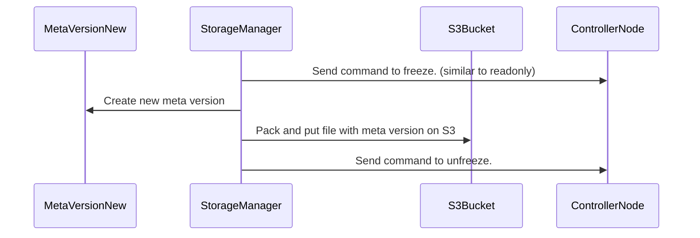
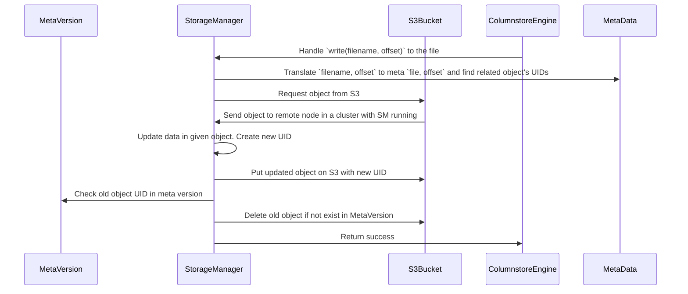
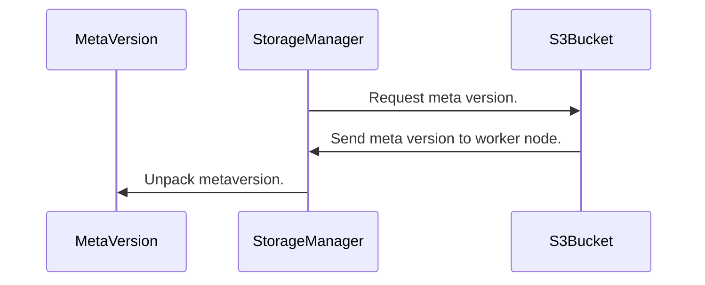

`Create meta version.`

```mermaid
sequenceDiagram
    participant MetaVersionNew
    participant StorageManager
    participant S3Bucket
    participant ControllerNode
    StorageManager->>ControllerNode: Send command to freeze. (similar to readonly)
    StorageManager->>MetaVersionNew: Create new meta version
    StorageManager->>S3Bucket: Pack and put file with meta version on S3
    StorageManager->>ControllerNode: Send command to unfreeze.
```

`DML command`

```mermaid
sequenceDiagram
    participant MetaVersion
    participant StorageManager
    participant S3Bucket
    participant ColumnstoreEngine
    participant MetaData
    ColumnstoreEngine->>StorageManager: Handle `write(filename, offset)` to the file
    StorageManager->>MetaData: Translate `filename, offset` to meta `file, offset` and find related object's UIDs
    StorageManager->>S3Bucket: Request object from S3
    S3Bucket->>StorageManager: Send object to remote node in a cluster with SM running
    StorageManager->>StorageManager: Update data in given object. Create new UID
    StorageManager->>S3Bucket: Put updated object on S3 with new UID
    StorageManager->>MetaVersion: Check old object UID in meta version
    StorageManager->>S3Bucket: Delete old object if not exist in MetaVersion
    StorageManager->>ColumnstoreEngine: Return success
```

`On rollback to version.`

```mermaid
sequenceDiagram
    participant MetaVersion
    participant StorageManager
    participant S3Bucket
    StorageManager->>S3Bucket: Request meta version.
    S3Bucket->>StorageManager: Send meta version to worker node.
    StorageManager->>MetaVersion: Unpack metaversion.
```
